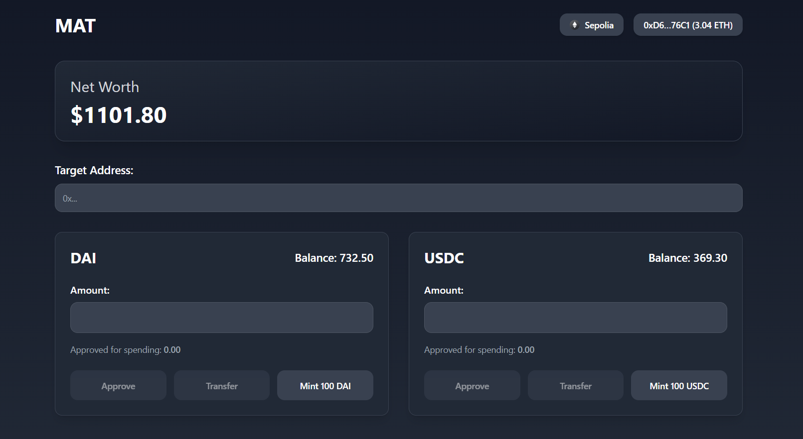

# MAT

A minimal template for token operations: **Mint**, **Approve**, and **Transfer**.

### Features

* **Mint** new tokens
* **Approve** allowances for spenders
* **Transfer** tokens between accounts

### Usage

Clone the repo and customize it for your token implementation.